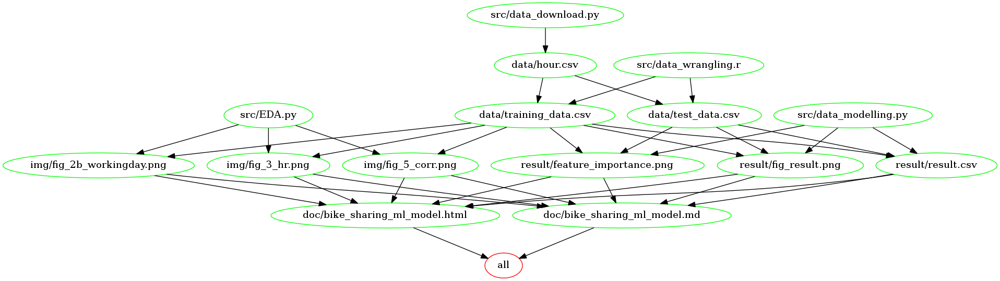

Group 409: Bike Sharing Machine Learning Model
================

[](https://opensource.org/licenses/MIT)

***Creators**: Aman Kumar Garg, Victor Cuspinera-Contreras, Yingping
Qian*

[Group Project Repo Link](https://github.com/UBC-MDS/DSCI_522_Group_409)

## About
Here we attempt to build a regression machine learning model using the Random Forest Regressor algorithm which predicts the count of bike rentals based on the time and weather-related information. The main predictive research question is "Given the information shared by Bike share company, can we predict the count of bike rentals on hourly basis in order to forecast the future demand of bike rentals?"

Our final model performed fairly well on an unseen test data set, with the mean square error of 70.39 and a visually linear relationship between actual and predicted values. However, the variance of predicted values becomes larger as the actual count of bike rentals increases, which indicates there are incorrectness in the model when the prediction is large. Thus we recommend continuing study to improve our machine learning model.

The dataset we are using to build a machine learning model is the bike-sharing dataset from UCI Machine Learning Repository. It contains both the hourly and daily data about the numbers of bike rentals in Washington, DC between 2011 and 2012. We would use the hourly dataset, which is more complete and have a greater number of observations than the daily dataset. The dataset has 1 target and 16 features, including both time and weather-related information for each hour on a specific day.

The dataset was created by Dr. Hadi (Fanaee-T 2013) from the Laboratory of Artificial Intelligence and Decision Support (LIAAD), at the (UCI Machine Learning Repository 2017) and can be found [here](https://archive.ics.uci.edu/ml/datasets/bike+sharing+dataset).

## Report
The final report can be found [here](https://ubc-mds.github.io/DSCI_522_Group_409/doc/bike_sharing_ml_model.html
)

## Usage
There are two suggested ways to run this analysis:

**1. Using docker**

*note - the instructions in this section also depends on running this in a unix shell (e.g., terminal or Git Bash)*

To replicate the analysis, please follow the instruction below:
1. Install [Docker](https://www.docker.com/get-started)
2. Clone this GitHub repository 
3. Download the docker image
```
docker pull doraqmon/group_409_bike_sharing:v1.0
```
4. Run the following command at the command line/terminal from the root directory of this project:
```
docker run --rm -v /$(pwd):/home/analysis doraqmon/group_409_bike_sharing:v1.0 make -C '/home/analysis' all
```
5. To reset the repo to a clean state, with no intermediate or results files, run the following command at the command line/terminal from the root directory of this project:
```
docker run --rm -v /$(pwd):/home/analysis doraqmon/group_409_bike_sharing:v1.0 make -C '/home/analysis' clean
```

**2. Without using Docker**

To replicate the analysis, clone this GitHub repository, install the [dependencies](#dependencies) listed below, and run the following command at the command line/terminal from the root directory of this project. Please note this process will take few minutes:
```
make all
```

To reset the repo to a clean state, with no intermediate or results files, run the following command at the command line/terminal from the root directory of this project:
```
make clean
```

## Dependency diagram of the Makefile



## Dependencies
- Python 3.7.3 and Python packages:
  - pandas==0.24.2  
  - numpy==1.16.4  
  - sklearn==0.22  
  - altair==3.2.0  
  - docopt==0.6.2 
  - selenium==3.141.0
  - seaborn==0.9.0

- R version 3.6.1 and R packages:
  - knitr==1.26
  - tidyverse==1.2.1
  - caret==6.0-84
  - kableExtra==1.1.0

## License

The Bike Sharing Dataset materials here are licensed as `CC0: Public Domain`. If re-using/re-mixing please provide attribution and link to this webpage.

## References

<div id="refs" class="references">

<div id="ref-uic_repo">
Dua, Dheeru and Graff, Casey. 2017. UCI Machine Learning Repository.
University of California, Irvine, School of Information and Computer 
Sciences.
<http://archive.ics.uci.edu/ml>
</div>
<br>
<div id="ref-hadi">
Fanaee-T, Hadi. 2013. “Bike Sharing Dataset Data Set.” University of
Porto, INESC Porto, Campus da FEUP, Rua Dr. Roberto Frias, 378, 4200 -
465 Porto, Portugal: Laboratory of Artificial Intelligence; Decision
Support (LIAAD); Machine, Learning Repository, UCI.  
<https://archive.ics.uci.edu/ml/datasets/bike+sharing+dataset>
</div>
<br>
<div id="ref-docopt">
Keleshev, Vladimir. 2014. docopt: Command-line interface description 
language. Python package version 0.6.2}.
<https://github.com/docopt/docopt>
</div>
<br>
<div id="ref-pandas">
McKinney, Wes and others. 2010. Pandas. Data structures for statistical 
computing in python, Proceedings of the 9th Python in Science Conference}, 
volume 445, pages 51--56, Austin, TX.
</div>
<br>
<div id="ref-numpy">
Oliphant, Travis E. 2006. A guide to NumPy. Volume=1, publisher Trelgol 
Publishing, USA.
</div>

<br>
<div id="ref-scklear">
Pedregosa, F., Varoquaux, G., Et Al. 2011. Scikit-learn: Machine 
Learning in Python. Journal of Machine Learning Research, volume 12, 
pages 2825--2830.
</div>
<br>
<div id="ref-altair">
VanderPlas, J., Granger, B., Et All. 2018. Altair: Interactive
Statistical Visualizations for Python. The Journal of Open Source 
Software, volume 3, number 32.
<http://idl.cs.washington.edu/papers/altair>
</div>
<br>
<div id="ref-seaborn">
Waskom, Michael. 2020. Seaborn: Statistical Data Visualization.
<https://seaborn.pydata.org>
</div>
<br>
<div id="ref-tidyverse">
Wickham, Hadley. 2017. Tidyverse: Easily Install and Load the ’Tidyverse’. <https://CRAN.R-project.org/package=tidyverse>
</div>
<br>
<div id="ref-knitr">
Xie, Yihui. 2014. “Knitr: A Comprehensive Tool for Reproducible Research in R.” In Implementing Reproducible Computational Research, edited by Victoria Stodden, Friedrich Leisch, and Roger D. Peng. Chapman; Hall/CRC. 
<http://www.crcpress.com/product/isbn/9781466561595>
</div>
<br>
<div id="ref-kableExtra">
Zhu, Hao. 2019. KableExtra: Construct Complex Table with ’Kable’ and Pipe Syntax. <https://cran.r-project.org/web/packages/kableExtra/index.html>
</div>

</div>
