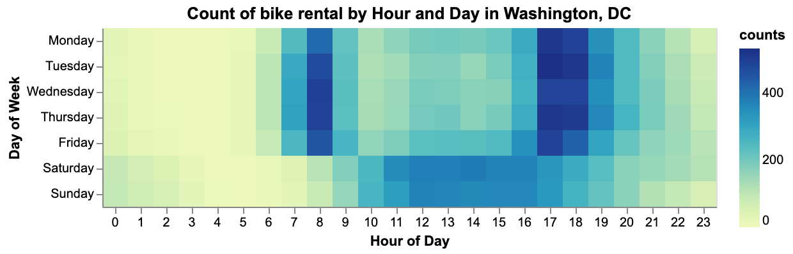

```{r setup, include=FALSE}
knitr::opts_chunk$set(echo = FALSE)
library(knitr)
library(kableExtra)
```

```{r load the results}
results <- read.csv("../result/result.csv")
test_err <- round(results$Test.Error[3], 2)
```

# Summary
Here we attempt to build a regression machine learning model using the Random Forest Regressor algorithm which predicts the count of bike rentals based on the time and weather-related information. Our final model performed fairly well on an unseen test data set, with the mean square error of ``r toString(test_err)`` and a visually linear relationship between actual and predicted values. However, the variance of predicted values becomes larger as the actual count of bike rentals increases, which indicates there are incorrectness in the model when the prediction is large. Thus we recommend continuing study to improve our machine learning model.

# Introduction
Demand forecasting is an important aspect for many companies in carrying out their operations. In our case, with the help of demand forecasting, a bike rental company can perform many tasks such as inventory management (no. of bikes), manpower management etc. Such planning will result in making operations efficient and effective. Planning and forecasting can help in facing sudden challenges and problems in a much better way.
Here we ask whether we can predict the count of bike rentals on an hourly basis in order to forecast the future demand for bike rentals given the information shared by Bike Share Company. Also, we want to find strong predictors that can help in predicting the future demand for bike rentals.

# Methods

## Data
The dataset we are using to build a machine learning model is the bike-sharing dataset from UCI Machine Learning Repository. It contains both the hourly and daily data about the numbers of bike rentals in Washington, DC between 2011 and 2012. We would use the hourly dataset, which is more complete and have a greater number of observations than the daily dataset. 

The dataset has 1 target and 16 features, including both time and weather-related information for each hour on a specific day. All the features and target are listed below:

1. `instant`: Record index  
2. `dteday`: Date  
3. `season`: Season (**1**:spring, **2**:summer, **3**:fall, **4**:winter)  
4. `yr`: Year (**0**: 2011, **1**:2012)  
5. `mnth`: Month  
6. `hr`: Hour  
7. `holiday`: (**0**: No, **1**: Yes)  
8. `weekday`: Day of the week (starting from **0**: Sunday)  
9. `workingday`: (**0**: No, **1**: Yes)  
10. `weathersit`:  (**1**: Clear, Few clouds, Partly cloudy, Partly cloudy. **2**: Mist + Cloudy, Mist + Broken clouds, Mist + Few clouds, Mist. **3**: Light Snow, Light Rain + Thunderstorm + Scattered clouds, Light Rain + Scattered clouds. **4**: Heavy Rain + Ice Pallets + Thunderstorm + Mist, Snow + Fog)  
11. `temp`: Normalized temperature in Celsius  
12. `atemp`: Normalized feeling temperature in Celsius  
13. `hum`: Normalized humidity  
14. `windspeed`: Normalized wind speed  
15. `casual`: count of casual users  
16. `registered`: count of registered users  
17. `cnt`: count of total rental bikes including both casual and registered  

The dataset was created by Dr. Hadi [@hadi] from the Laboratory of Artificial Intelligence and Decision Support (LIAAD), at the [@uic_repo].

We have performed an explanatory data analysis (EDA), the full report can be found [here](https://github.com/UBC-MDS/DSCI_522_Group_409/blob/master/eda/EDA_summary.md). In this analysis, we built some visualizations to deep dive the data and found the relationships between different variables, as well as the explanatory variables with a higher correlation with the target variable (number of bikes rented). As we can see from Figure 1. below, the demand for bikes increases when the weather is warmer and decreases when the temperatures are lower.
  
```{r, echo=FALSE, fig.cap="Figure 1. Analysis of temperatures by workingday", out.width = '65%'}
knitr::include_graphics("../img/fig_2b_workingday.png")
```

Another visualization we want to point out is the heatmap outlining how the day of week and hour of day affect the count of bike rental.  We found that people use bike rentals mainly for work and school on weekdays showing the peak of the demand in two times of the day. Besides, people use rental bikes between 11 am and 4 pm during weekends.


```{r, echo=FALSE, fig.cap="Figure 2. Analysis per hour and weekday", out.width = '70%'}

```

The correlation matrix between features, including the target variable, is shown below.

```{r, echo=FALSE, fig.cap="Figure 3. Correlation matrix", out.width = '70%'}
knitr::include_graphics("../img/fig_5_corr.png")
```

## Analysis
The [Random Forest Regressor](https://scikit-learn.org/stable/modules/generated/sklearn.ensemble.RandomForestRegressor.html) from Scikit-learn [@scikit] was used as the final model to build a regression model to predict the count of bike rentals on an hourly basis. The original dataset has the categorical features preprocessed using label encoding and numerical features preprocessed using [MinMaxScalar](https://scikit-learn.org/stable/modules/generated/sklearn.preprocessing.MinMaxScaler.html) from Scikit-learn [@scikit]. In order to not violate the golden rule of machine learning, we decided to de-normalize the numerical features before train and test data splitting and apply feature scaling afterwards in our modelling process. We also changed `holiday` and `workingday` to [OneHotEncoding](https://scikit-learn.org/stable/modules/generated/sklearn.preprocessing.OneHotEncoder.html) from Scikit-learn [@scikit].

All variables included in the original dataset, except `instant`, `dteday`, `yr`, `casual` and `registered`, were used to fit the training data. The hyperparameters (i.e. ‘max_depth’ and ‘n_estimators’) were chosen used 5-fold cross-validation with mean squared error as the regression metric.

The R [@r] and Python [@python] programming langues and the following R and Python packages were used to perform the analysis: caret [@caret], docop [@docoptr], knitr [@knitr], tidyverse [@tidyverse], pandas [@pandas], scikit-learn [@scikit], altair [@altair], scipy [@scipy], numpy [@numpy], docop [@docopt], os [@python], ast [@python], seaborn [@seaborn], kabelextra [@kable]. The code used to perform the analysis and create this report can be found [here](https://github.com/UBC-MDS/DSCI_522_Group_409).

# Results & Discussion
To make the prediction model, it is required to test different models and check which model fits best. There are several methods available to check which model is best suited for the bike rental data. For this problem, we have used `mean_squared_error` and calculated the error for both training and testing error as shown below. Moreover, we have also tuned hyperparameters to get the best model with the best hyperparameters.   

```{r model compare}
kable((results), caption = "Table 1. Training and Testing error for k-nearest neighbors, RandomForest and Linear Regression.") %>% 
  kable_styling(bootstrap_options = "striped", full_width = F)

m <- results$Model[3]
h <- results[[7]][3]
test_err <- results$Test.Error[3]
```


As we can see above, ``r toString(m)`` from Scikit-learn [@scikit] is the best model with minimum training and testing error. By hyperparameter tuning, we get best hyper parameters as ``r toString(h)``. 


It is possible to see the feature importance through random forest regression. We have plotted the feature importance for all the features as shown below.


```{r, echo=FALSE, fig.cap="Figure 4: The plot for importance for predictors.", out.width = '85%'}
knitr::include_graphics("../result/feature_importance.png")
```

The variable `hr` is the most important feature to predict bike ridership. The second most important feature is `temp`. It is also interesting to know if it is a working day or not which also matters in predicting the number of bike rentals.

In order to visualize the results, we also plotted the point graph between actual rides and predicted rides. The predicted rides are from test data set using the best model, ``r toString(m)``. 

```{r, echo=FALSE, fig.cap="Figure 5: The plot for predicted and actual rides", out.width = '85%'}
knitr::include_graphics("../result/fig_result.png")
```

The relationship is looking very linear which means that predicted values are close to the actual values. The model can be used to predict the ridership in the future given the input features. 

In order to improve our model further, we can perform more feature engineering and can potentially use One hot encoding instead of Label encoding on features such as week day and seasons. Then, we can check if there is an improvement in the training and testing errors. 


# References
