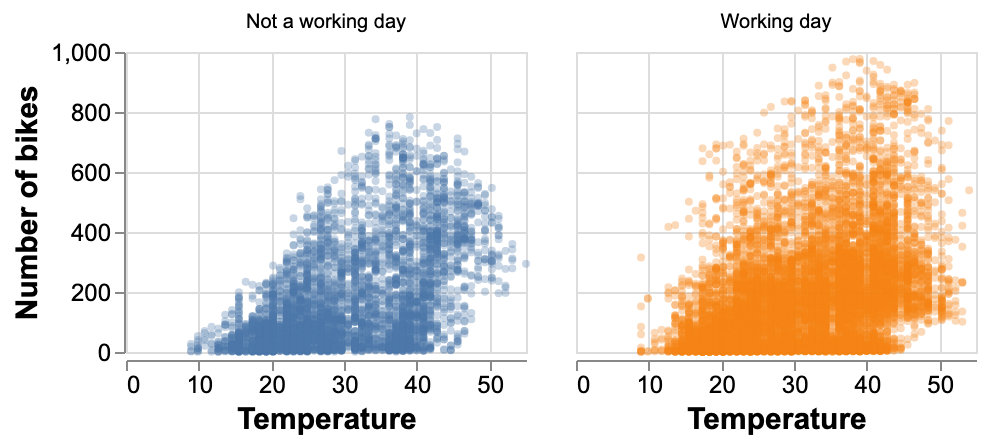
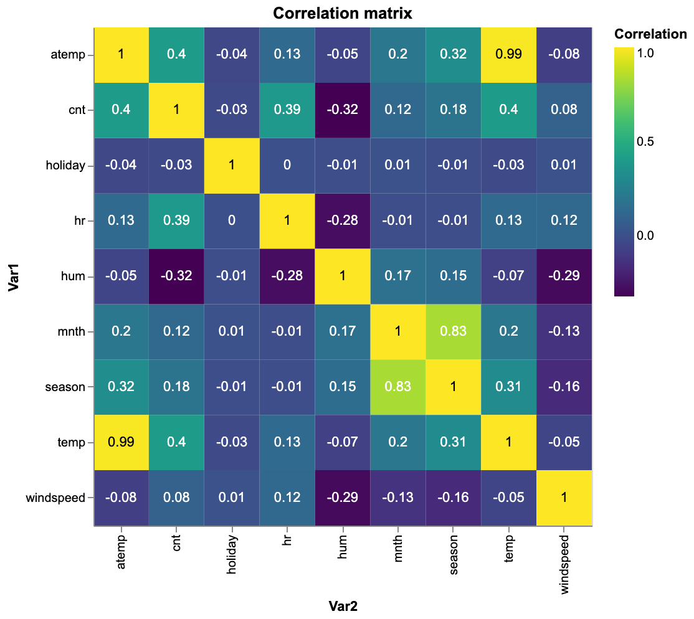
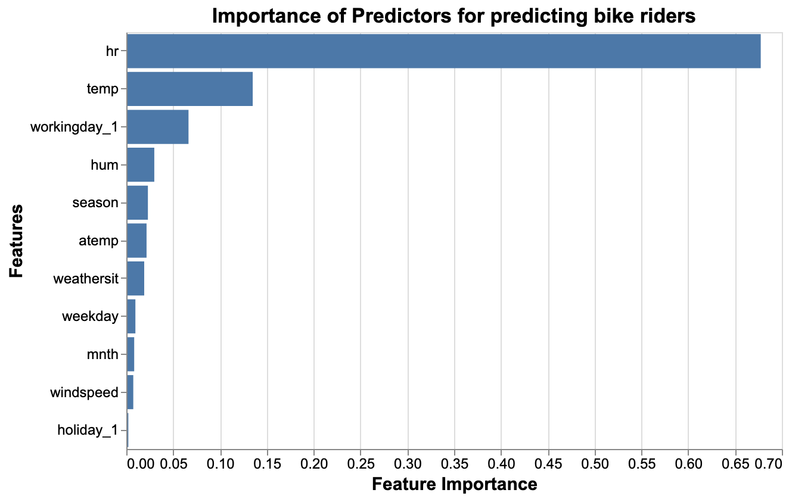
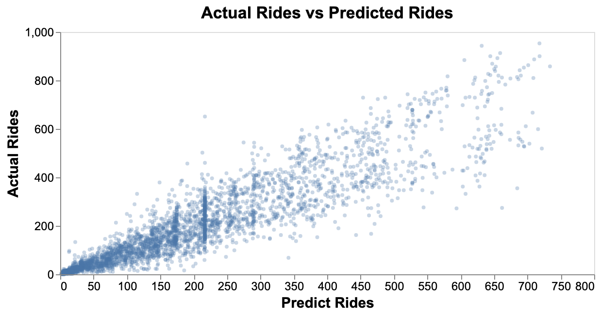

Bike Sharing Machine Learning Model
================
Aman Kumar Garg, Victor Cuspinera-Contreras, Yingping Qian
24/01/2020 (updated: 2020-02-07)

# Summary

Here we attempt to build a regression machine learning model using the
Random Forest Regressor algorithm which predicts the count of bike
rentals based on the time and weather-related information. Our final
model performed fairly well on an unseen test data set, with the mean
square error of `70.54` and a visually linear relationship between
actual and predicted values. However, the variance of predicted values
becomes larger as the actual count of bike rentals increases, which
indicates there are incorrectness in the model when the prediction is
large. Thus we recommend continuing study to improve our machine
learning model.

# Introduction

Demand forecasting is an important aspect for many companies in carrying
out their operations. In our case, with the help of demand forecasting,
a bike rental company can perform many tasks such as inventory
management (no. of bikes), manpower management etc. Such planning will
result in making operations efficient and effective. Planning and
forecasting can help in facing sudden challenges and problems in a much
better way. Here we ask whether we can predict the count of bike rentals
on an hourly basis in order to forecast the future demand for bike
rentals given the information shared by Bike Share Company. Also, we
want to find strong predictors that can help in predicting the future
demand for bike rentals.

# Methods

## Data

The dataset we are using to build a machine learning model is the
bike-sharing dataset from UCI Machine Learning Repository. It contains
both the hourly and daily data about the numbers of bike rentals in
Washington, DC between 2011 and 2012. We would use the hourly dataset,
which is more complete and have a greater number of observations than
the daily dataset.

The dataset has 1 target and 16 features, including both time and
weather-related information for each hour on a specific day. All the
features and target are listed below:

1.  `instant`: Record index  
2.  `dteday`: Date  
3.  `season`: Season (**1**:spring, **2**:summer, **3**:fall,
    **4**:winter)  
4.  `yr`: Year (**0**: 2011, **1**:2012)  
5.  `mnth`: Month  
6.  `hr`: Hour  
7.  `holiday`: (**0**: No, **1**: Yes)  
8.  `weekday`: Day of the week (starting from **0**: Sunday)  
9.  `workingday`: (**0**: No, **1**: Yes)  
10. `weathersit`: (**1**: Clear, Few clouds, Partly cloudy, Partly
    cloudy. **2**: Mist + Cloudy, Mist + Broken clouds, Mist + Few
    clouds, Mist. **3**: Light Snow, Light Rain + Thunderstorm +
    Scattered clouds, Light Rain + Scattered clouds. **4**: Heavy Rain +
    Ice Pallets + Thunderstorm + Mist, Snow + Fog)  
11. `temp`: Normalized temperature in Celsius  
12. `atemp`: Normalized feeling temperature in Celsius  
13. `hum`: Normalized humidity  
14. `windspeed`: Normalized wind speed  
15. `casual`: count of casual users  
16. `registered`: count of registered users  
17. `cnt`: count of total rental bikes including both casual and
    registered

The dataset was created by Dr. Hadi (Fanaee-T 2013) from the Laboratory
of Artificial Intelligence and Decision Support (LIAAD), at the (UCI
Machine Learning Repository 2017).

We have performed an explanatory data analysis (EDA), the full report
can be found
[here](https://github.com/UBC-MDS/DSCI_522_Group_409/blob/master/eda/EDA_summary.md).
In this analysis, we built some visualizations to deep dive the data and
found the relationships between different variables, as well as the
explanatory variables with a higher correlation with the target variable
(number of bikes rented). As we can see from Figure 1. below, the demand
for bikes increases when the weather is warmer and decreases when the
temperatures are
lower.

Another visualization we want to point out is the heatmap outlining how
the day of week and hour of day affect the count of bike rental. We
found that people use bike rentals mainly for work and school on
weekdays showing the peak of the demand in two times of the day.
Besides, people use rental bikes between 11 am and 4 pm during
weekends.

The correlation matrix between features, including the target variable,
is shown
below.

## Analysis

The [Random Forest
Regressor](https://scikit-learn.org/stable/modules/generated/sklearn.ensemble.RandomForestRegressor.html)
from Scikit-learn (Pedregosa et al. 2011) was used as the final model to
build a regression model to predict the count of bike rentals on an
hourly basis. The original dataset has the categorical features
preprocessed using label encoding and numerical features preprocessed
using
[MinMaxScalar](https://scikit-learn.org/stable/modules/generated/sklearn.preprocessing.MinMaxScaler.html)
from Scikit-learn (Pedregosa et al. 2011). In order to not violate the
golden rule of machine learning, we decided to de-normalize the
numerical features before train and test data splitting and apply
feature scaling afterwards in our modelling process. We also changed
`holiday` and `workingday` to
[OneHotEncoding](https://scikit-learn.org/stable/modules/generated/sklearn.preprocessing.OneHotEncoder.html)
from Scikit-learn (Pedregosa et al. 2011).

All variables included in the original dataset, except `instant`,
`dteday`, `yr`, `casual` and `registered`, were used to fit the training
data. The hyperparameters (i.e. ‘max\_depth’ and ‘n\_estimators’) were
chosen used 5-fold cross-validation with mean squared error as the
regression metric.

The R (R Core Team 2019) and Python (Van Rossum and Drake 2009)
programming langues and the following R and Python packages were used to
perform the analysis: caret (Jed Wing et al. 2019), docop (de Jonge
2018), knitr (Xie 2014), tidyverse (Wickham 2017), pandas (McKinney and
others 2010), scikit-learn (Pedregosa et al. 2011), altair (Sievert
2018), scipy (Virtanen et al. 2019), numpy (Oliphant 2006), docop
(Keleshev 2014), os (Van Rossum and Drake 2009), ast (Van Rossum and
Drake 2009), seaborn (Waskom 2020), kabelextra (Zhu 2019). The code used
to perform the analysis and create this report can be found
[here](https://github.com/UBC-MDS/DSCI_522_Group_409).

# Results & Discussion

To make the prediction model, it is required to test different models
and check which model fits best. There are several methods available to
check which model is best suited for the bike rental data. For this
problem, we have used `mean_squared_error` and calculated the error for
both training and testing error as shown below. Moreover, we have also
tuned hyperparameters to get the best model with the best
hyperparameters.

<table class="table table-striped" style="width: auto !important; margin-left: auto; margin-right: auto;">

<caption>

Table 1. Training and Testing error for k-nearest neighbors,
RandomForest and Linear Regression.

</caption>

<thead>

<tr>

<th style="text-align:right;">

index

</th>

<th style="text-align:left;">

Model

</th>

<th style="text-align:right;">

Train.Error

</th>

<th style="text-align:right;">

Test.Error

</th>

<th style="text-align:right;">

Train.r2.score

</th>

<th style="text-align:right;">

Test.r2.score

</th>

<th style="text-align:left;">

Best.Parameters

</th>

<th style="text-align:right;">

Computational.Time..sec.

</th>

</tr>

</thead>

<tbody>

<tr>

<td style="text-align:right;">

0

</td>

<td style="text-align:left;">

LinearRegression

</td>

<td style="text-align:right;">

147.91

</td>

<td style="text-align:right;">

145.61

</td>

<td style="text-align:right;">

0.34

</td>

<td style="text-align:right;">

0.35

</td>

<td style="text-align:left;">

{‘normalize’: True}

</td>

<td style="text-align:right;">

0.11

</td>

</tr>

<tr>

<td style="text-align:right;">

0

</td>

<td style="text-align:left;">

KNN

</td>

<td style="text-align:right;">

72.19

</td>

<td style="text-align:right;">

78.43

</td>

<td style="text-align:right;">

0.84

</td>

<td style="text-align:right;">

0.81

</td>

<td style="text-align:left;">

{‘n\_neighbors’: 15}

</td>

<td style="text-align:right;">

1.66

</td>

</tr>

<tr>

<td style="text-align:right;">

0

</td>

<td style="text-align:left;">

RandomForest

</td>

<td style="text-align:right;">

64.09

</td>

<td style="text-align:right;">

70.54

</td>

<td style="text-align:right;">

0.88

</td>

<td style="text-align:right;">

0.85

</td>

<td style="text-align:left;">

{‘max\_depth’: 10, ‘n\_estimators’: 50}

</td>

<td style="text-align:right;">

122.12

</td>

</tr>

</tbody>

</table>

As we can see above, `RandomForest` from Scikit-learn (Pedregosa et al.
2011) is the best model with minimum training and testing error. By
hyperparameter tuning, we get best hyper parameters as
`{'max_depth': 10, 'n_estimators': 50}`.

It is possible to see the feature importance through random forest
regression. We have plotted the feature importance for all the features
as shown
below.

The variable `hr` is the most important feature to predict bike
ridership. The second most important feature is `temp`. It is also
interesting to know if it is a working day or not which also matters in
predicting the number of bike rentals.

In order to visualize the results, we also plotted the point graph
between actual rides and predicted rides. The predicted rides are from
test data set using the best model,
`RandomForest`.

The relationship is looking very linear which means that predicted
values are close to the actual values. The model can be used to predict
the ridership in the future given the input features.

In order to improve our model further, we can perform more feature
engineering and can potentially use One hot encoding instead of Label
encoding on features such as week day and seasons. Then, we can check if
there is an improvement in the training and testing errors.

# References

de Jonge, Edwin. 2018. *Docopt: Command-Line Interface Specification
Language*. <https://CRAN.R-project.org/package=docopt>.

Fanaee-T, Hadi. 2013. “Bike Sharing Dataset Data Set.” University of
Porto, INESC Porto, Campus da FEUP, Rua Dr. Roberto Frias, 378, 4200 -
465 Porto, Portugal: Laboratory of Artificial Intelligence; Decision
Support (LIAAD); Machine, Learning Repository, UCI.
<https://archive.ics.uci.edu/ml/datasets/bike+sharing+dataset>.

Jed Wing, Max Kuhn. Contributions from, Steve Weston, Andre Williams,
Chris Keefer, Allan Engelhardt, Tony Cooper, Zachary Mayer, et al. 2019.
*Caret: Classification and Regression Training*.
<https://CRAN.R-project.org/package=caret>.

Keleshev, Vladimir. 2014. *Docopt: Command-Line Interface Description
Language*. <https://github.com/docopt/docopt>.

McKinney, Wes, and others. 2010. “Data Structures for Statistical
Computing in Python.” In *Proceedings of the 9th Python in Science
Conference*, 445:51–56. Austin, TX.

Oliphant, Travis E. 2006. *A Guide to Numpy*. Vol. 1. Trelgol Publishing
USA.

Pedregosa, F., G. Varoquaux, A. Gramfort, V. Michel, B. Thirion, O.
Grisel, M. Blondel, et al. 2011. “Scikit-Learn: Machine Learning in
Python.” *Journal of Machine Learning Research* 12: 2825–30.

R Core Team. 2019. *R: A Language and Environment for Statistical
Computing*. Vienna, Austria: R Foundation for Statistical Computing.
<https://www.R-project.org/>.

Sievert, Jacob VanderPlas AND Brian E. Granger AND Jeffrey Heer AND
Dominik Moritz AND Kanit Wongsuphasawat AND Arvind Satyanarayan AND
Eitan Lees AND Ilia Timofeev AND Ben Welsh AND Scott. 2018. “Altair:
Interactive Statistical Visualizations for Python.” *The Journal of Open
Source Software* 3 (32). <http://idl.cs.washington.edu/papers/altair>.

UCI Machine Learning Repository. 2017. University of California, Irvine,
School of Information; Computer Sciences.
<http://archive.ics.uci.edu/ml>.

Van Rossum, Guido, and Fred L. Drake. 2009. *Python 3 Reference Manual*.
Scotts Valley, CA: CreateSpace.

Virtanen, Pauli, Ralf Gommers, Travis E. Oliphant, Matt Haberland, Tyler
Reddy, David Cournapeau, Evgeni Burovski, et al. 2019. “SciPy
1.0–Fundamental Algorithms for Scientific Computing in Python.” *arXiv
E-Prints*, July, arXiv:1907.10121.

Waskom, Michael. 2020. *Seaborn: Statistical Data Visualization*.
<https://seaborn.pydata.org>.

Wickham, Hadley. 2017. *Tidyverse: Easily Install and Load the
’Tidyverse’*. <https://CRAN.R-project.org/package=tidyverse>.

Xie, Yihui. 2014. “Knitr: A Comprehensive Tool for Reproducible Research
in R.” In *Implementing Reproducible Computational Research*, edited by
Victoria Stodden, Friedrich Leisch, and Roger D. Peng. Chapman;
Hall/CRC. <http://www.crcpress.com/product/isbn/9781466561595>.

Zhu, Hao. 2019. *KableExtra: Construct Complex Table with ’Kable’ and
Pipe Syntax*.
<https://cran.r-project.org/web/packages/kableExtra/index.html>.

