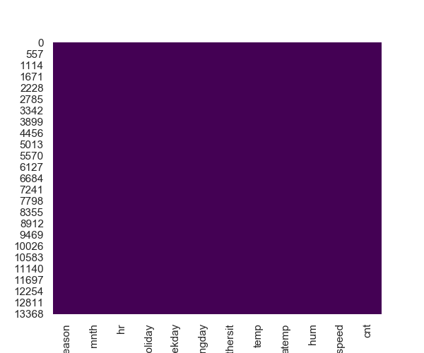
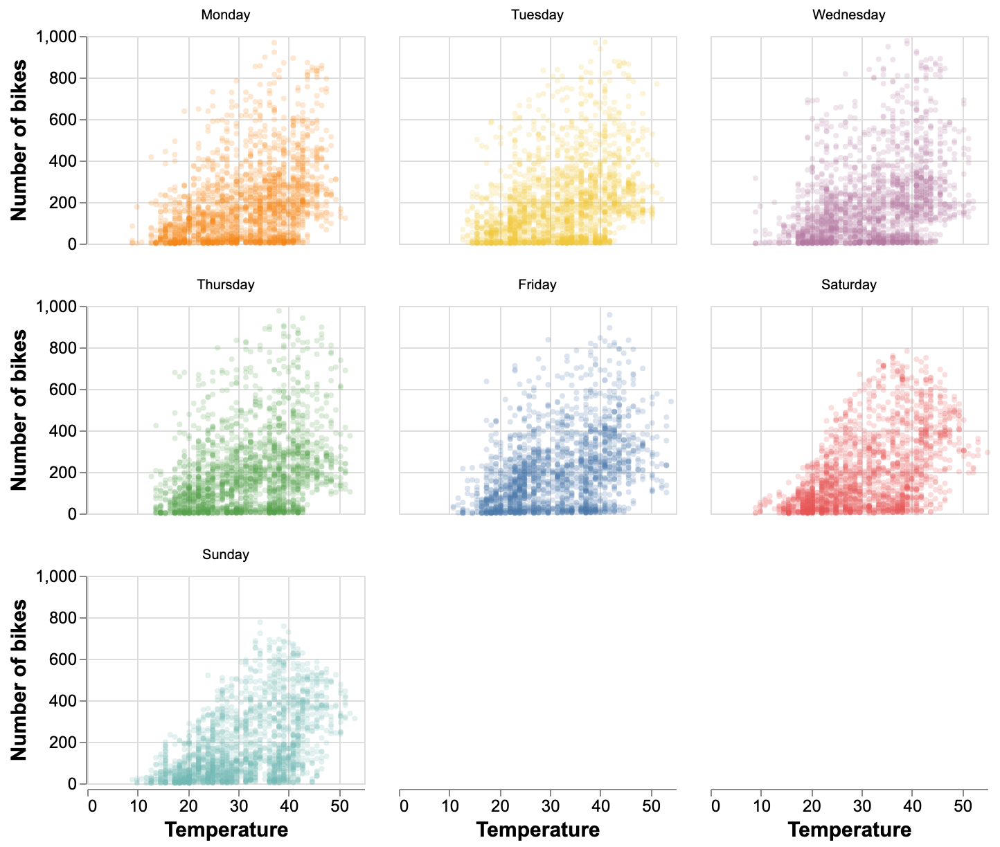

```{r setup, include=FALSE}
knitr::opts_chunk$set(echo = FALSE, warning = FALSE, message=FALSE)
library(feather)
library(tidyverse)
library(knitr)
library(kableExtra)
library(caret)
library(ggridges)
library(ggthemes)
theme_set(theme_minimal())
```

# Description
The dataset we chose is the Bike Sharing Dataset from [UCI machine learning repository]("https://archive.ics.uci.edu/ml/datasets/bike+sharing+dataset"). This dataset contains the hourly and daily count of rental bikes in 2011 and 2012 in Capital bikeshare system in Washington, DC with the corresponding weather and seasonal information. It is provided by Hadi Fanaee-T, Laboratory of Artificial Intelligence and Decision Support (LIAAD), University of Porto.  
For the purpose of this project, we would use the hourly dataset, which is more complete and have a greater number of observations than the daily dataset.  
<br>

# Exploration of the dataset

Some important insights:  
1. The target `cnt` (i.e. count of total rental bikes) is highly correlated with `registered` (i.e. count of registered users). Since our research question does not care about whether the user is registered or casual users. We decided to remove `registered` and `casual` columns.  
2. The report is showing that `temp` and `atemp` are highly correlated with each other. They both are normalized temperatures in Celsius while `atemp` is the feeling temperature and `temp` is the real temperature. We decided to create a new column called `temp_actual` (i.e. the non-normalized actual temperature) and remove `temp` and `atemp` columns.  
3. `dtday` is a DateTime column, which has a high cardinality. We decided to remove it because there are other time-related columns, such as `mnth` and `hr`, we can use to answer our research question.  

```{r statistic summary}
stats_summary <- read.csv("../img/tab_1.csv")
kable((stats_summary), caption = "Table 1. Summary basic statistics for the variable.")
```

# Checking the Null Values

```{r plot nulls, fig.cap = "Figure 1. Null values in the dataset", out.width = '65%'}

```
  
**Comments**: As we can see from the plot above there is no null values in the dataset.  
  
# Initial Thoughts
Some findings and important observations:  
- The original dataset has 17 variables with 13,903 observations, but not all variables would be useful for the model: in some cases, the variables are highly correlated as `temp` and `atemp`, and other variables that won't be as useful as `instant` that is the id. of the observation.  
- The operation of the bike rentals runs 24 hr even on weekends and holidays. However, if we consider that the target variable `cnt` ranges from 1 to 977 users, we could find out that there are no observations for some combinations of hours and days (probably because nobody rent any bike in that specific moment); for example, there is no data at 10 am of January 2nd of 2012 (dteday='2012-01-02', yr=10).  
- The real temperature (`temp`) and feeling temperature `atemp` are normalized with different scales, which can be confusing to interpret.  
- The original source of the data comes from the company [Capital Bikeshare](https://s3.amazonaws.com/capitalbikeshare-data/index.html) which in their website have a section to [download the bike rental files](https://s3.amazonaws.com/capitalbikeshare-data/index.html) from September 2010 until November 2019. These files have the information rent with variables as day, time, bike id., start and end stations, and member type; however, these files don't include other useful information as holidays, weather, temperature, humidity and wind speed that could affect the number of bike rentals and are included in the dataset that we are interested to use. For this reason, it would be better to work with the information retrieved from the [UCI machine learning repository](https://archive.ics.uci.edu/ml/datasets/bike+sharing+dataset).  
  
# Research Questions
Our main predictive research question is:
> Given the information shared by Bike share company, can we predict the count of bike rentals in order to forecast the future demand?

The sub-questions is:
> Identify the strongest predictors that can help in predicting the future demand for bike rentals. (predictive)  
<br>
> Identify the regression model that would have a better performance to predict the future demand for bike rentals. (predictive)

# Data Analysis & Visualizations

## 7.1 Analysis of temperatures on bike rental count
Would you rent a bike to commute to your work on a 25˚C sunny-day? And how about on a winter day with a temperature below 0˚C?  
We believe that the temperature could be an important variable to predict the future demand of bike rentals, so we start our analysis with a faceted plot comparing the temperature with the number of rented bikes, by weekday.  
```{r plot temp, fig.cap = "Figure 2. Analysis of temperatures by weekday", out.width = '90%'}

```
<br>
**Observations:** In general, the demand for rental bikes increases when the weather is warmer and decreases when the temperature is lower; this particular behaviour is more observed on weekends. Also, from this comparison, we can see that more bikes are rented on weekdays, probably because people commute to their work or school.  

## 7.2 Analysis of hour and weekday on bike rental count
With the previous analysis, we can think that people use the rental bikes for different objectives in the function of the day of the week. This is a good point to arise another question: does the hour also affect the demand for bike rentals?  
```{r plot hr, fig.cap = "Figure 3. Analysis per hour and weekday", out.width = '90%'}
knitr::include_graphics("../img/fig_3_hr.png")
```
<br>
**Observations**: In the previous plot we can confirm the hypothesis that people use the bike rentals mainly for work and school on the weekdays showing the peak of the demand in two times of the day: in the morning around 8 hr., and the afternoon between 17 and 18 hr.; on the weekends people use the rental bikes between 11 and 16 hours.  
In the other hand, the time with the lowest demand of rental bikes is between 1 and 5 hr. everyday.

## 7.3 Analysis of weather and humidity on demand for rental bikes
To rent or not to rent a bike, that is the question. And the answer would not be only based on temperature, day and time, but also it would be important to think about weather and humidity, because is not the same to ride a bike on a sunny day than in a rainy one.
```{r plot weather, fig.cap = "Figure 4. Analysis of weather and humidity", out.width = '80%'}

```
<br>
**Observations**: To understand the previous graphs it will be important to remmember that the weather (`weathersit`) with number 1 is related to a mainly sunny day, while 2 recalls a misty day, a 3 would reference to a lightly rain or snowy day, and 4 with heavy rain, snow or ice.  
In general we could see that people preffer to ride the rental bikes in sunny days, followed by days with mist, and few people rent then on days with light rain, and as it is logic almost nobody rent bikes on days with heavy rain or snow.  
In the other hand, we can observe the demand for bike rental increases in days less humid.

## 7.4 Correlation matrix
Which variables are related which each other? That's a question for the correlation matrix!
```{r correlation matrix, fig.cap = "Figure 5. Correlation matrix between variables", out.width = '85%'}
knitr::include_graphics("../img/fig_5_corr.png")
```
<br>
**Observations**: In the previous table we can find which variables are related with each other. Over all correlations, it stands out the relation between the `month` and the `season` which make sense with a correlation of 0.83  

Additionally, as we could imagine for the previous plots and comments, in this table we can see that for the number of bike rented (`cnt`), there are two variables that stands out for its high correlation with the target variable: the temperature (`temp_actual`) and the hour of the day (`hr`), both with a correlation around 0.40, followed by humidity with a coefficient equals to -0.33  

# References